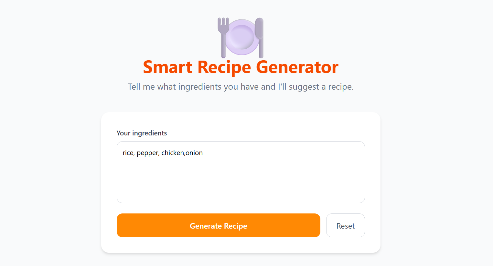
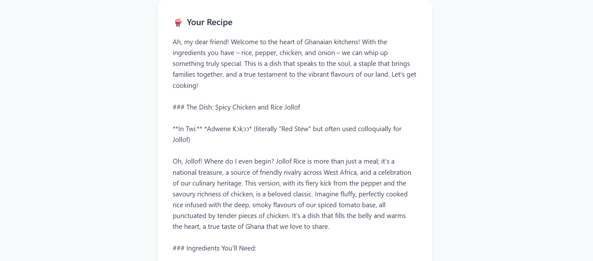
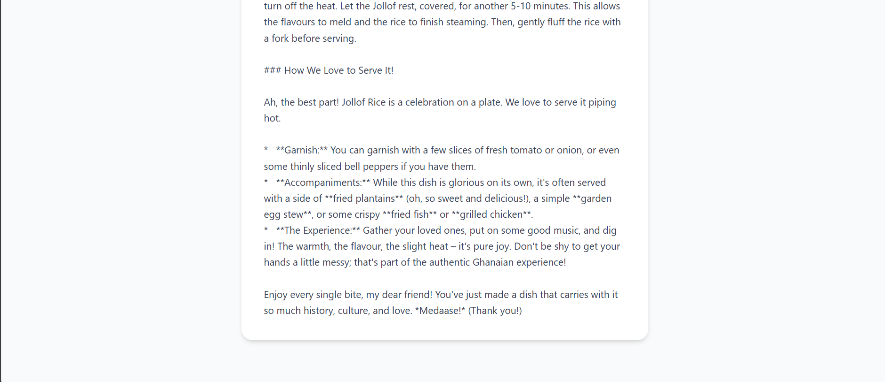

# Recipe Demo Application

A mobile application for browsing and discovering new recipes.

## Preview

|  |  |  |
| :---: | :---: | :---: |
| Home Screen | Recipe Details | Search Results |

## Features

- **Recipe Discovery**: Browse a collection of delicious recipes.
- **Detailed Instructions**: Step-by-step guides for each recipe.
- **Visual Previews**: High-quality images for each dish.

## Getting Started

Follow these instructions to get the project up and running on your local machine.

### Installation

1. Clone the repository:
   ```bash
   git clone https://github.com/Mtettey29/recipedemo.git
   ```
2. Navigate to the project directory:
   ```bash
   cd recipedemo
   ```
3. Install the dependencies:
   ```bash
   npm install
   ```

## License

This project is licensed under the MIT License - see the [LICENSE](LICENSE) file for details.
